# Global Electronic Dashboard

_Analyzing revenues and customer behavior to support business sales and help to understand the seasonsal pattern and delivery using pandas and Power BI_

## Tables of Contents
- <a href = '#overview'>Overview</a>
- <a href = '#business-problem'>Business Problem</a>
- <a href = '#dataset'>Dataset</a>
- <a href = '#project-structure'>Project Structure</a>
- <a href = '#data-cleaning'>Data cleaning and Preparation</a>
- <a href = '#tech-stack'>Tech Stack</a>
- <a href = '#key-feature'>Key Feature</a>
- <a href = '#system-architecture'>System Architecture</a>
- <a href = '#Dashboard-screenshot'>Dashboard Screenshot</a>
- <a href = '#watch-full-dashboard'>Watch Full Dashboard</a>
- <a href = '#contact'>Contact</a>

---

<h2><a class="anchor" id="overview"></a>Overview</h2>

The project focused on Seasonal pattern, revenue, delivery dusration and customer behavior for Global Electronic retails.
The Dashboard transaform raw data into meaningful insights, helps the business to improve the decision making for business growth.

----

<h2><a class="anchor" id="business-problem"></a>Business Problem</h2>

1. Which brands sales more based on country
2. Revenue based on gender and category
3. How customer purchased (online & offline)
4. Time duration of Delivery
5. How much Active or Churned

---

<h2><a class="anchor" id="dataset"></a>Dataset</h2>

Raw Data Excel file is located in '/Data/RawData' folder
Data used in Power BI Excel file is located in '/Data/PowerBIData' folder

---

<h2><a class="anchor" id="project-structure"></a>Project Structure</h2>

```

├── Data
│   └──PowerBIData
│   │    └──final_dataset.csv
│   └──RawData
│        └──Customers.csv
│        └──Exchange_Rates.csv
│        └──Products.csv
│        └──Sales.csv
│        └──Stores.csv
├── DataCleaning
│    └──clean_data.py
│    └──decode_special_char.py
│    └──load_data.py
│    └──sales_performing.py
├── images
├── global electronic.pbix
├── README.md

```

---

<h2><a class="anchor" id="data-cleaning"></a>Data cleaning</h2>

1. In Dataset there are character with different font is hard to use for analysis so I have decode the special character
2. Changed the datatype of some columns like gender,country, orderdate, deiverydate, etc

---

<h2><a class="anchor" id="tech-stack"></a>Tech Stack</h2>

- **Excel** - Data source
- **Pandas** - data cleaning and processing
- **PowerBI** - Visualizationa and Dashboard

---

<h2><a class="anchor" id="key-feature"></a>Key Feature</h2>

## 1. Revenue analysis
- By Store-Type [Online/Offline] (Treemap)
- By Genders (Donut Chart)
- AOV by Store-Type (Donut Chart)
- Countries Revenue,Quantity, Profit (Table)
- By Category (Clustered Column Chart)

## 2. Yearly analysis
- Revenue by Store-Type (Line Chart)
- Duration Delivery (Line Chart)
- Monthly Revenue of Store-Type (Line Chart)

## 3. Brand Analysis
- By Color (Clustered Column Chart)
- Brand Revenue (Clustered Bar Chart)
- Brand Quantity (Clustered Bar Chart)

## Customer Behavior
- Customer Status (Donut Chart)
- AOv by YEar (Clustered Column Chart)

---

<h2><a class="anchor" id="system-architecture"></a>System Architecture</h2>

```

Excel Dataset
     ↓
Data Preprocessing (Pandas)
     ↓
Feature Engineering
     ↓
Data Filtering (Power BI)
     ↓
Visualization (Power BI)
     ↓
Interactive Dashboard (Power BI)

```

---

<h2><a class="anchor" id="dashboard-screenshot"></a>Dashboard Screenshot</h2>

**Power BI Shows:**
 - KPI's
 - Revenue Analysis
 - Yearly Analysis
 - Brand Analysis
 - Customer Behavior

---

**KPI**
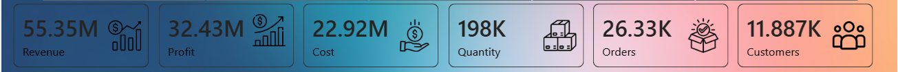

It Display the total revenue, cost, profit, quantity and numbers of customers over country

---

**Revenue by Store-type**
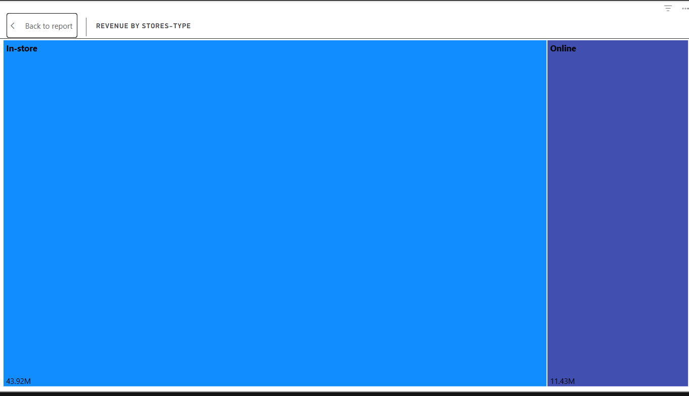

This Chart shows how much sales is done in online orders and offline orders. As we can see 80% customer prefer in-store to purchase product.

---

**Revenue by Gender**
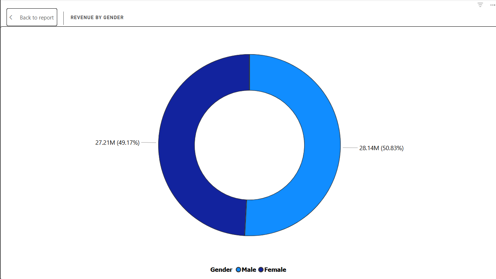

We can see 51% Male in gender used to purchased product rather than Female which is 49%.

---

**AOV by Sotre-Type**
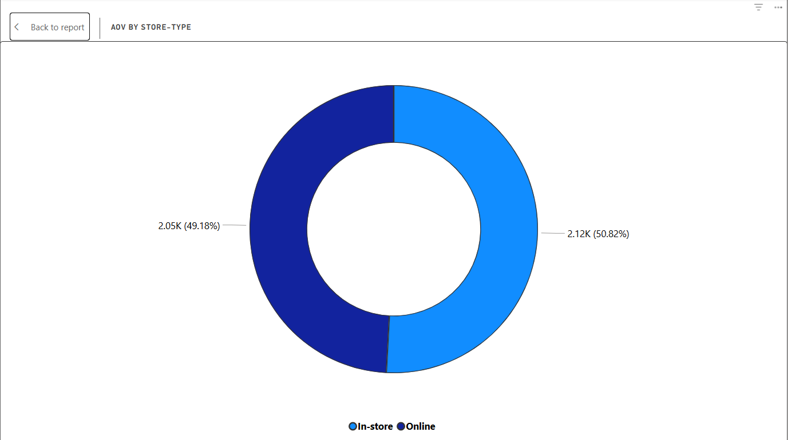

Average order value between online and offline store is slightly different

---

**Country Details**
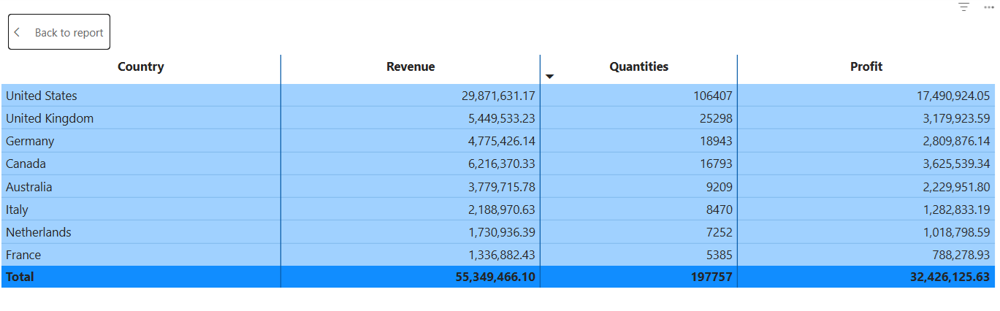

Through table we can see that the United States have the highest revenue and profit rather than other countries.

---

**Revenue by Category**


Computers are the highly demands in every countries because it is used companies as well as in homes. As per demand we have to increase our valuable sales in computers category.

---

**Revenue and Store-Type by Year**
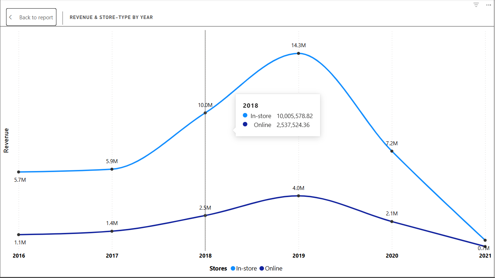

The yearly revenue is increasing to decreasing throughout the year, shows the business sales is decreased 50% after 2019 all over the country. We have to focus on customers and have a good product to interact the customer.

---

**Delivery Duration by Year**
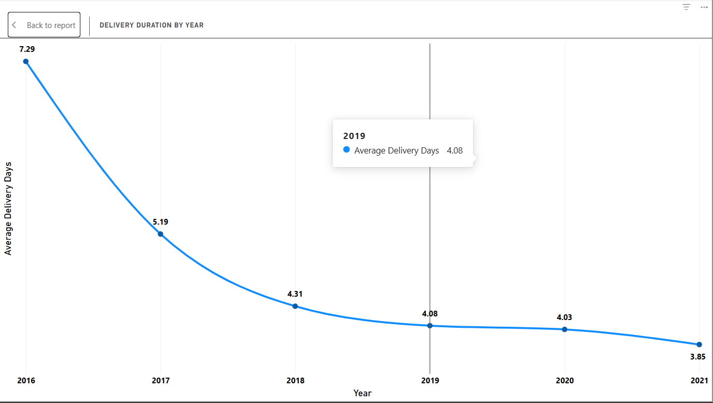

For online the delivery duration is gone in downward direction after 2016, but the online order is more in 2019 but the delivery time is not good than 2016 year. This will be the reason of low sales due to time duration of delivery or may be product quality.

---

**Revenue & Store-type by Month**
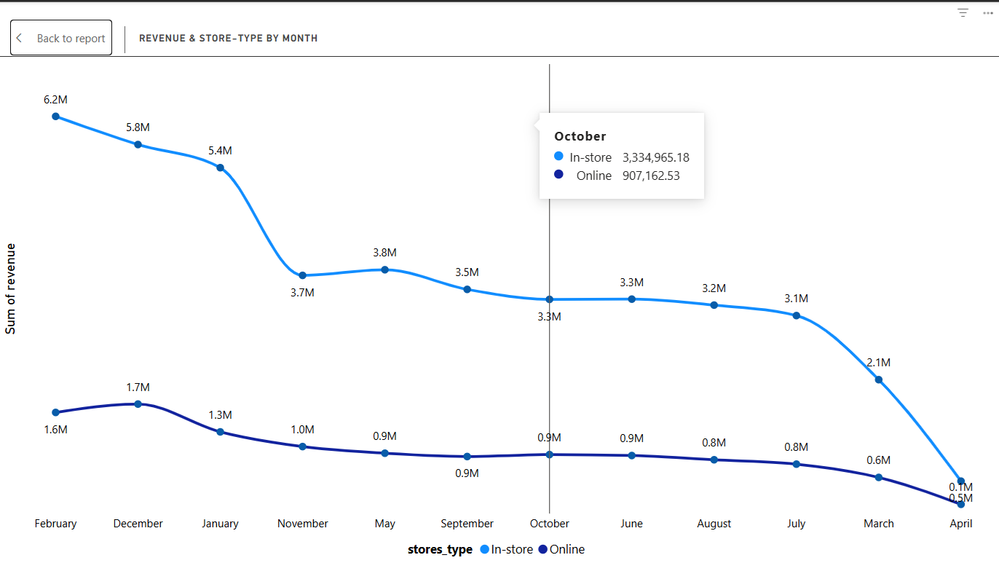

In Revenue by month the more low sales is done in month of April than in March. We have to focus on this moth by giving some offer and Discount. The more advertisment of product the more customer will interact and this will generate more sales.

---

**Revenue by color**
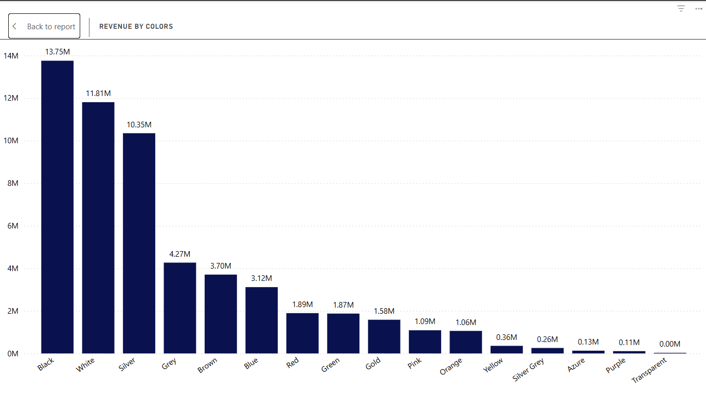

Most of the customer prefer black color than the other color. As we have already seen the product sold is Computers which is black in color also TV and mobile are mostly choosed in black color. After Black, the White color is also in demand moslty in Home appliance and other things

---

**Revenue by Brand**
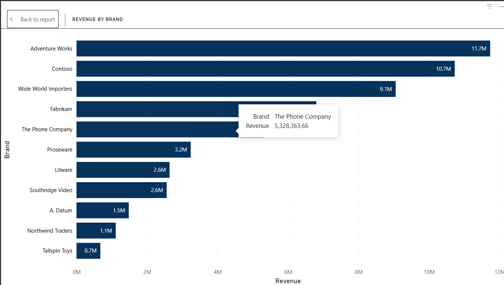

The Adventure works brand has the highest revenue with less quantity, express the cost of this brand is more than others. And another brand is contoso also  have the high revenue than other but less than Adventure works and the quantity is also greater than others which indicate the **premium pricing strategy** or a **luxury product** 

---

**Quantity by Brand**
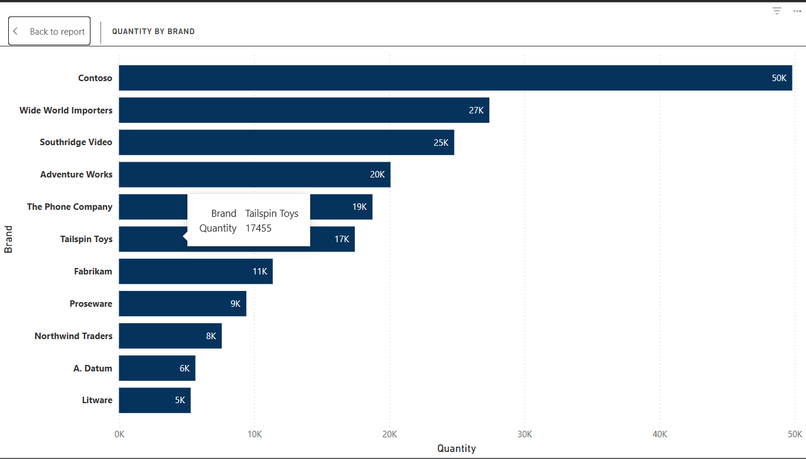

The quantity of brand is high in **Contoso** as well as it's revenue. As we already discussed, the more more quantity increase revenue but in luxury product which is *Adventure works* less quantity sold with high price.

---

**Customer status**
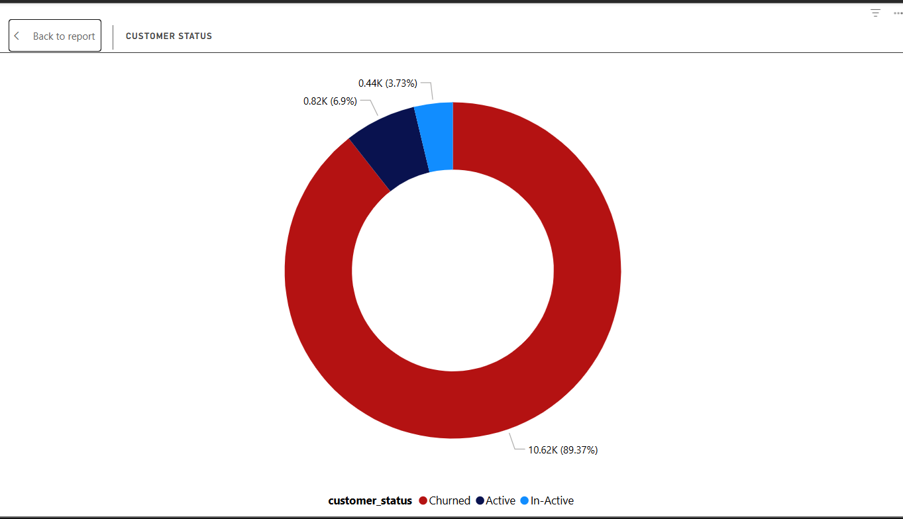


The churned rate is higher than the active customers which impact on business as our customer is on more interact with our products. We have to focused on customers while giving offer and discount focus on delivery duration which also make huge different. We can also interact with customers through mails and chats to advertise our product with average price.

---

**AOV by Year**
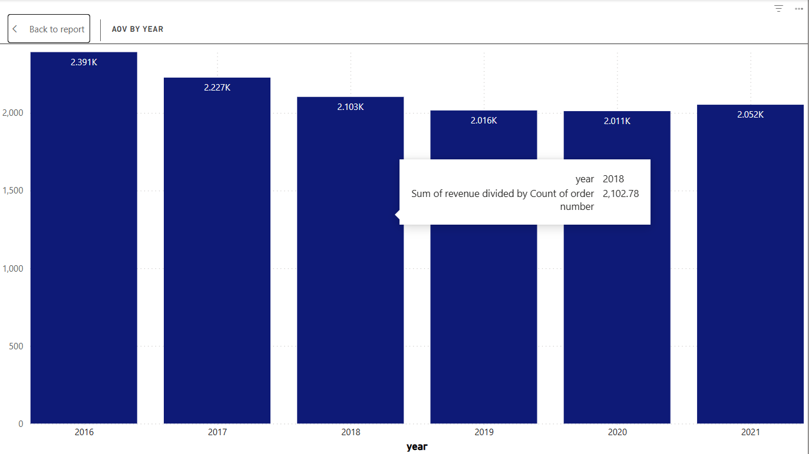

The Average value of order is decreasing from 2017 lead to low revenue.

---

<h2><a class="anchor" id="watch-full-dashboard"></a>Watch Full Dashboard</h2>

**To watch full Dashboard**

Global Electronic Dashboard
[Download the Dashboard](./global%20electronic.pbix)

---

<h2><a class="anchor" id="contact"></a>Contact</h2>

**Deepak Ramdhari Vishwakarma**
Data Analyst (Pursing)
Email: deepakvishwakarma1302@gmail.com
Contact no.: 7045669414